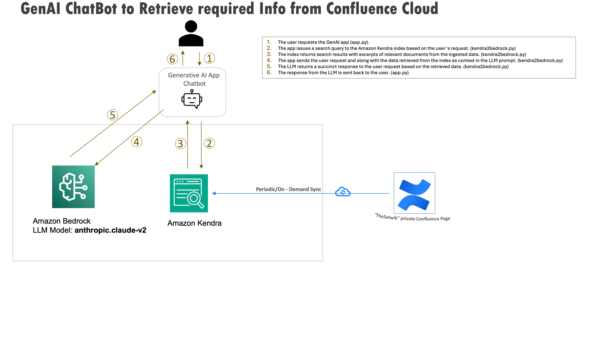

# Chatbot helper on Confluence documents - Amazon-Bedrock-RAG-Kendra(with Confluence as DataSource)
This is sample code demonstrating the use of Amazon Bedrock and Generative AI to implement a Retrieval Augmented Generation (RAG), based architecture with Amazon Kendra. The application is constructed with a simple streamlit frontend where users can ask questions against documents stored in Amazon Kendra.
Thanks to "https://github.com/aws-rdoty" from where the streamlit code is exported as a base and necessary minor changes are made to adjust our use case. 

# **Goal of this Repo:**
The goal of this repo is to provide users the ability to use Amazon Bedrock and generative AI to take natural language questions, and answer questions against indexed Confluence documents in Amazon Kendra.
This repo comes with a basic frontend to help users stand up a proof of concept in just a few minutes.
This is **NOT** for Production usage as this does not have necessary guairdrails and application set up is on local machine(inside a virtual environment). 
However, with needed modifications, the (almost) similar architecture can be deployed for Production usage. (Hopefully I will come up in coming days)

The architecture and flow of the sample application will be:



When a user interacts with the GenAI app, the flow is as follows:

1. The user makes a request to the GenAI app (app.py).
2. The app issues a search query to the Amazon Kendra index based on the user request. (kendra2bedrock.py)
3. The index returns search results with excerpts of relevant documents from the ingested data. (kendra2bedrock.py)
4. The app sends the user request and along with the data retrieved from the index as context in the LLM prompt. (kendra2bedrock.py.py)
5. The LLM returns a succinct response to the user request based on the retrieved data. (kendra2bedrock.py.py)
6. The response from the LLM is sent back to the user. (app.py)

# How to use this Repo:

## Prerequisites:
1. Amazon Kendra Index has been created (IF NOT ALREADY CREATED please check [Instruction HERE](README_KendraIndexForConfluence.md)).
2. Amazon Kendra Index has a Confluence datasource configured and synced (IF NOT ALREADY CREATED the same is covered in above instruction).
3. Amazon Bedrock Access and CLI Credentials.  (Not a best practise for Production, but OK for this POC)
4. Appropriate permissions to configure Amazon Kendra Index and Amazon Kendra Data Sources.
5. Python 3.9 installed on local machine, it is the most stable version of Python for the packages we will be using, it can be downloaded from [HERE](https://www.python.org/downloads/release/python-3911/). for Ubuntu follow from [HERE](https://linuxize.com/post/how-to-install-python-3-9-on-ubuntu-20-04/)

## Step 1:
The first step of utilizing this repo is performing a git clone of the repository.

```
git clone <clone URL>
```

After cloning the repo onto your local machine, open it up in your favorite code editor.The file structure of this repo is broken into 3 key files,
the app.py file, the kendra2bedrock.py file, and the requirements.txt. The app.py file houses the frontend application (a streamlit app). 
The kendra2bedrock.py file houses the logic of the application, including the Kendra Retrieve API calls and Amazon Bedrock API invocations.
The requirements.txt file contains all necessary dependencies for this sample application to work.
---

## Step 2:
Set up a python virtual environment in the root directory of the repository and ensure that you are using Python 3.9. This can be done by running the following commands:
```
pip install virtualenv
python3.9 -m venv venv
```
The virtual environment will be extremely useful when you begin installing the requirements. If you need more clarification on the creation of the virtual environment please refer to this [blog](https://www.freecodecamp.org/news/how-to-setup-virtual-environments-in-python/).
After the virtual environment is created, ensure that it is activated, following the activation steps of the virtual environment tool you are using. Likely:
```
cd venv
cd bin
source activate
cd ../../ 
```
After your virtual environment has been created and activated, you can install all the requirements found in the requirements.txt file by running this command in the root of this repos directory in your terminal:
```
pip install -r requirements.txt
```
---

## Step 3:
Now that the requirements have been successfully installed in your virtual environment we can begin configuring environment variables.
You will first need to create a .env file in the root of this repo. Within the .env file you just created you will need to configure the .env to contain:

```
profile_name=<aws_cli_profile_name>
kendra_index=<kendra_index> (kendra index ID -- see blow image)
```

Please note that `kendra_index` variable corresponds to **Index ID**, not the ~~name~~ of the index. 


Please ensure that your AWS CLI Profile has access to Amazon Bedrock, and your Amazon Kendra Index has been created within your AWS account!

***If you don't have your Amazon Kendra Index created or confluence datasoruce is not configured yet, please follow the steps given in :[README_KendraIndexForConfluence](README_KendraIndexForConfluence.md)***

Depending on the region and model that you are planning to use Amazon Bedrock in, you may need to reconfigure below two lines in the kendra2bedrock.py file:

```
bedrock = boto3.client('bedrock-runtime', 'us-west-2', endpoint_url='https://bedrock.us-west-2.amazonaws.com')

modelId = 'anthropic.claude-v2'
```
**_NOTE:_**  I chose Oregon(us-west-2) for my experient becuase as of doing this POC, this region has most bedrocl Large Language Models (LLMs) available. 

---

## Step 4:
Now that you have cloned the repo, created a virtual environment, set the environment variables, and provisioned your Kendra index, it is now time
to sync a data source within Kendra. 

You can sync wide range of data source with Kendra - [documentation](https://docs.aws.amazon.com/kendra/latest/dg/hiw-data-source.html).
In this case we are using Confluence as a data source. 

 ---

## Step 5:
As soon as you have successfully synced your data source with your Kendra Index, your application should be ready to go. To start up the application with its basic frontend you simply need to run the following command in your terminal while in the root of the repositories' directory:

```
streamlit run app_gTTS.py
```
The above command will start app on port 8501. If you want to use any different port (say 8080), use below command 

```
streamlit run app_gTTS.py --server.port 8080
```
As soon as the application is up and running in your browser of choice you can begin asking natural language questions against the documents stored within your Amazon Kendra index. 


----

## Step 6 

Deactive the virual enviroment, when you are done with this POC experience. 

```
deactive
```


## ***The contents of this repository represent my viewpoints along with respources from other Piblic git repos, blogs, AWS documentations, and not of my past or current employers. All third-party libraries, modules, plugins, and SDKs are the property of their respective owners.***